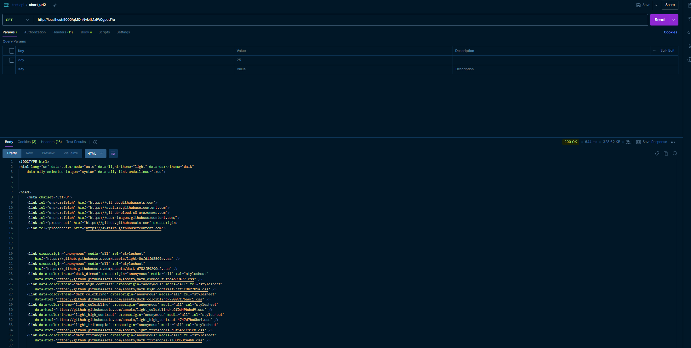
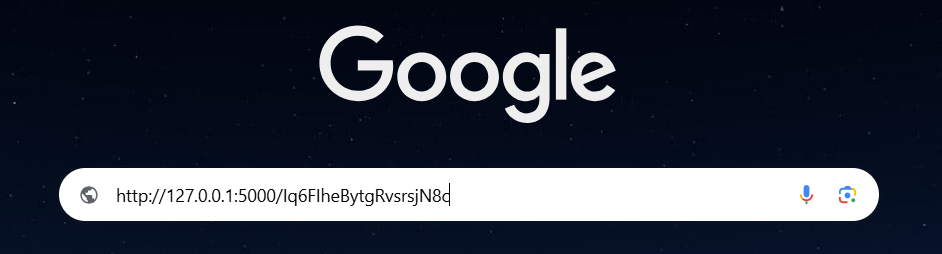
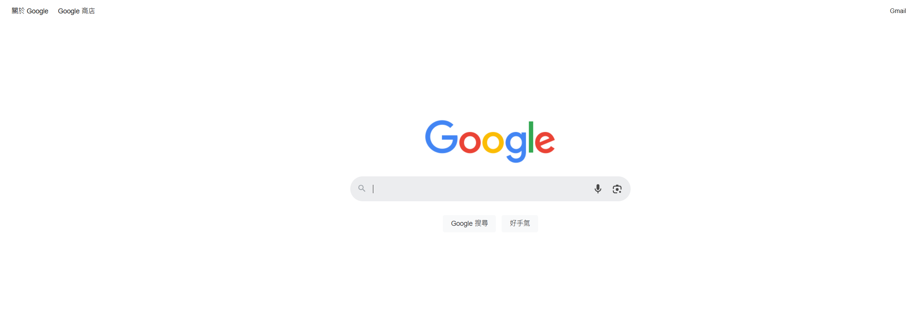

# short_url

## Description
This is a project implementing two short_url RESTful HTTP APIs, including a **POST** method generating the original URL into a short URL and a **GET** method redirecting the short URL back to the original URL. Other features including short_url expiration time and invalid url format errors are included. Information including original URL, short_url and expiration time are stored in a simple SQLite file.

## Requirements
* Python 3.9+
* flask 2.0.*
* Docker (optional)
* Docker Compose (optional)

## Setup
#### Local Setup
Clone the project from github:

    git clone https://github.com/WilliamYeh123/short_url.git
    cd short_url

create virtual environment(optional):

    python -m venv venv
    source venv/bin/activate

install dependencies:

    pip install -r requirements.txt

run service:

    python main.py

#### Docker Setup (Build Docker Image)
Clone the project from github:

    git clone https://github.com/WilliamYeh123/short_url.git
    cd short_url

build image using Dockerfile, then run the service:

    docker build -t short_url:v1.0 .
    docker run -d --name url-service -p 5000:5000 short_url:v1.0

or you can choose using docker compose, better if you are adding other services in the future
but docker compose needs to be installed, base on different version, command may be different

    docker compose up -d
    # older version:
    docker-compose up -d

#### Docker Setup (Pull from Docker Hub)
Directly pull the docker image from Docker Hub

    docker pull williamyeh0068511/short_url:v1.0

start the service:

    docker run -d --name url-service -p 5000:5000 williamyeh0068511/short_url:v1.0

## API Usage

This part introduces how to use the API service, assuming the service is running on localhost, the base URL is `http://127.0.0.1:5000/`, `ip` and `port` can be set based on different environment, `port` can be modified in `config.py` or `docker-compose.yml` if using docker compose.

### API 1: Create Short URL
---
* `url`: `http://127.0.0.1:5000/url/create`
* method: `POST`
* description: take an URL as input, then returns shortened URL, which is a 20 character token added after the base URL, returns error message if `original_url` is invalid

request parameter:
| parameter     | type   | description                          |
|---------------|--------|--------------------------------------|
| original\_url | string | the original url you want shortening |

url rule:
* total length under 2048
* original_url not empty
* includes domain
* includes `http://` or `https://`

response parameter:
| parameter        | type      | description                               |
|------------------|-----------|-------------------------------------------|
| original\_url    | string    | the original url you want shortening      |
| short\_url       | string    | short url generated from the original url |
| success          | bool      | if the url is shorten successfully        |
| reason           | string    | shows success message or error message    |
| expiration\_time | timestamp | expiration time, 30 days after created    |

response message:
| status code | message                               |
|-------------|---------------------------------------|
| 200         | Success creating short URL            |
| 400         | Bad request                           |
| 413         | URL too long \(should be under 2048\) |
| 422         | Invalid format                        |

#### Example Usage
sample request payload:

    {
        "original_url":"https://www.google.com.tw/?hl=zh_TW"
    }
sample return data:

    # success
    {
        "expiration_date": 1737876798.399497,
        "original_url": "https://www.google.com.tw/?hl=zh_TW",
        "reason": "Success creating short URL",
        "short_url": "http://127.0.0.1:5000/qMQhNvk4k1zlW0gpoUYa",
        "success": true
    }
    # error
    {
        "reason": "Invalid format: must include scheme (http:// or https://) and domain",
        "success": false
    }

running with Linux:

    curl --request POST \
     --url http://127.0.0.1:5000/url/create \
     --header 'accept: application/json' \
     --header 'content-type: application/json' \
     --data '{"original_url":"https://www.google.com.tw/?hl=zh_TW"}'
### API 2: Redirect Short URL
---
* `url`: `http://127.0.0.1:5000/<string:short_url>`
* method: `GET`
* description: send `GET` request with URL returned from the first API, or simply search the URL in the browser, it would redirect to the original URL, returns error message if the short URL expired (30 dyas) or URL wasn't found in database. the database only stores the token, which is the 20 character behind, so it's ok to change ip and port as long as the data isn't removed from the table.

response message:
| status code | message                    |
|-------------|----------------------------|
| 200         | Success creating short URL |
| 404         | URL not found              |
| 410         | URL has expired            |

#### Example Usage
running with Linux:

    curl --request GET \
     --url http://localhost:5000/qMQhNvk4k1zlW0gpoUYa \
     --header 'accept: application/json'

it would show redirecting message:

    <!DOCTYPE HTML PUBLIC "-//W3C//DTD HTML 3.2 Final//EN">
    <title>Redirecting...</title>
    <h1>Redirecting...</h1>
    
You should be redirected automatically to target URL: <a href="https://github.com/scikit-learn/scikit-learn/blob/main/README.rst?plain=1">https://github.com/scikit-learn/scikit-learn/blob/main/README.rst?plain=1</a>. If not click the link.

run in postman:

search in browser:
type short_url in browser

then redirects to the original website

example of expired url:

    {
        "error": "URL has expired",
        "expired_at": "Sun, 27 Oct 2024 09:37:19 GMT"
    }